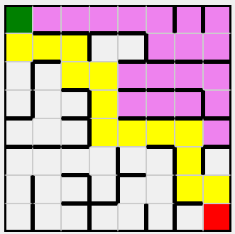
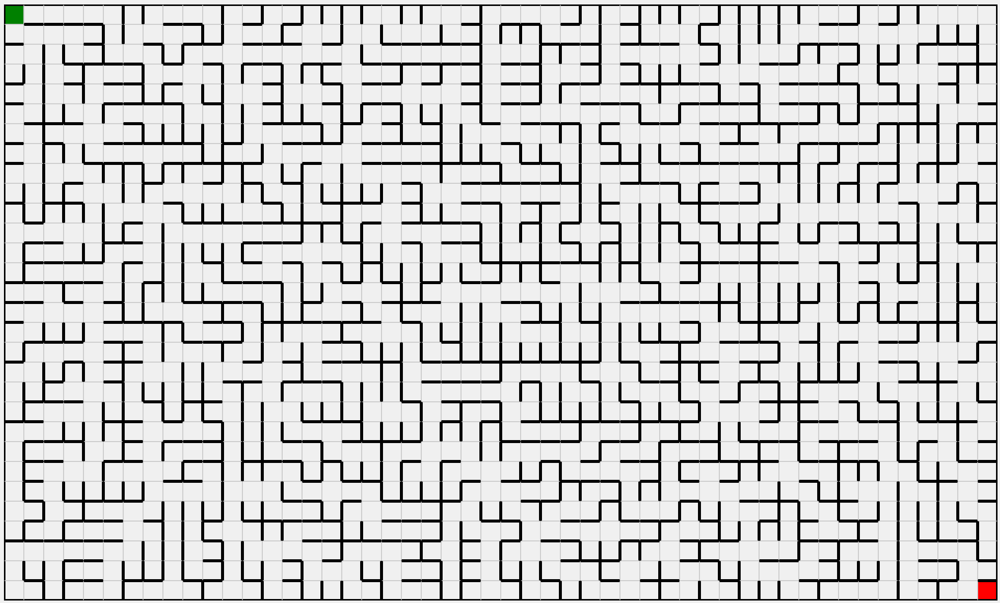

# Theseus' Labyrint

Mening med dette mini projekt er at både lave et program som gennem Prim's algoritme kan lave en labyrint, og som så derefter gennem Depth-first search (DFS) kan løse den selv samme labyrint.

Jeg har på [resultat siden](https://markusingerslev.github.io/Labyrint/) valgt at benytte version af projektet, hvor de to opgaver er blevet slået sammen til en. Dog har jeg forsat valgt at main version som ses på GitHub standard for projektet er den version, hvor de to opgaver stadig er delt op.

#### Kort indholdsfortegnelse

 1. [Labyrint solve](#labyrint-solver)
 1. [Labyrint generator](#labyrint-generator)

## Labyrint solver

#### Algoritme brug

Jeg har brugt **Depth-First Search (DFS) algoritmen med backtracking**. Denne algoritme udforsker så langt som muligt langs hver rute, før den backtracker, hvilket gør den effektiv til at finde en rute fra start til mål i labyrinten.

#### Rekursion, stack eller kombination?

Jeg har brugt en kombination af rekursion og en stack klasse. `visitCell` funktionen er rekursiv og besøger celler ved at kalde sig selv. Samtidig bruger jeg en custom `Stack` klasse fra filen `stack.js` til at gemme ruten. Hver gang en celle besøges, bliver den pushet til stacken. Hvis algoritmen rammer en blindgyde, popper den celler fra stacken for at backtracke.

#### Håndtering af backtracking

Jeg viser backtracking i labyrinten. Når algoritmen backtracker fra en blindgyde, markeres disse celler med en anden farve (i dette tilfælde violet) for at indikere de stier, der blev udforsket men ikke førte til målet. Den endelige rute fra start til slut vises med en gul farve. Dette giver en visuel repræsentation af både den succesfulde rute og de områder, hvor algoritmen måtte backtracke.

#### Beregning af ruten

Jeg beregner ruten i ét hug. Hele ruten fra start til mål bliver beregnet på én gang under udførelsen af DFS-algoritmen. Når ruten er fundet, bliver den vist på labyrinten med det samme uden nogen animation.

#### Andet relevant information om koden

**Status håndtering:**
 Jeg bruger et statusobjekt `{goalReached: false}` til at holde styr på, om målet er nået. Dette forhindre ydeligere rekursive kald, når ruten til målet er fundet, hvilket optimerer algoritmen.

**Retningsrækkefølge:**
Jeg benytter fast retningsrækkefølge til at bestemme orden af hvilken nabo der bliver *"besøgt"* først `["east", "south", "west", "north"]`. Jeg har dog også tilføjet en funktion der gør det muligt at blande retningsrækkefølgende ved hvert *"besøg"* gennem funktion `shuffleDirections(directions)`. Lige nu så står denne funktion udmarkeret, men når den bliver aktiveret, så blander den rækkerfølgende af de 4 tidligere retninger ved hvert nyt besøg en celle laver. 

## Labyrint generator

#### Prim's algoritme

Til generering af labyrinter har jeg valgt at implementere Prim's algoritme for labyrintgenerering. Prim's algoritme er en grafalgoritme, der typisk bruges til at finde minimumsspændende træ i en vaægtet, sammenhængende graf. Når den tilpasses til labyrintgenerering, fungerer algoritmen ved at:

1. Starte med et gitter af celler, hvor alle celler er omgivet af vægge.
2. Vælge en tilfældig celle som startpunkt og markere den som en del labyrinten.
3. Tilføje alle vægge omkring denne celle til en liste (ofte kaldet en "kantliste" eller "wall list").
4. Mens der er vægge i listen:
    - Vælge en tilfældig væg fra listen.
    - Hvis cellen på den anden side af væggen ikke er besøgt (ikke en del af labyrinten endnu):
      - Fjern væggen mellem de to celler for at skave en passage.
      - Marker den nye celle som en del af labyrinten.
      - Tilføj de omkringliggende vægge af den nye celle til væglisten.
    - Fjern væggen fra væglisten.

Denne proces forsætter, indtil alle celler er blevet en del af labyrinten. Resultatet er en perfekt labyrint, hvilket betyder, at der er en unik sti mellem enhver to punkter i labyrinten uden isolerede områder eller cyklusser,

#### Ressourcer brugt

Under udviklingen af labyrint generatoren har jeg brugt følgende ressourcer til at forstå og implementere Prim's algoritme:

- Wikipedia: Maze Generation Algorithms
  - [Wikipedia: Maze generation algorithm](https://en.wikipedia.org/wiki/Maze_generation_algorithm#Randomized_Prim's_algorithm)
  - **Beskrivelse:** Artikel der giver en oversigt og grundlæggende forklaring omkring forskellige algoritmer til at kunne generere en labyrint.

- Rosetta Code: Maze Generation
  - [Maze generation - Rosetta Code](https://rosettacode.org/wiki/Maze_generation#JavaScript)
  - **Beskrivelse:** Rosetta code er en samling af eksempler på, hvordan man løser de samme opgaver i forskellige programmeringssprog. Har benyttet denne side til at få en forståelse for hvordan man implementere dette i JavaScript.

- Stack Overflow
  - [Implementing Prim's algorithm for maze generation](https://stackoverflow.com/questions/14215847/jtextfield-validation-for-numbers-and-one-decimal-point/29586507#29586507)
  - **Beskrivelse:** Har benyttet bland flere til at få svar på hvordan specifikke ting skal implementeres.
